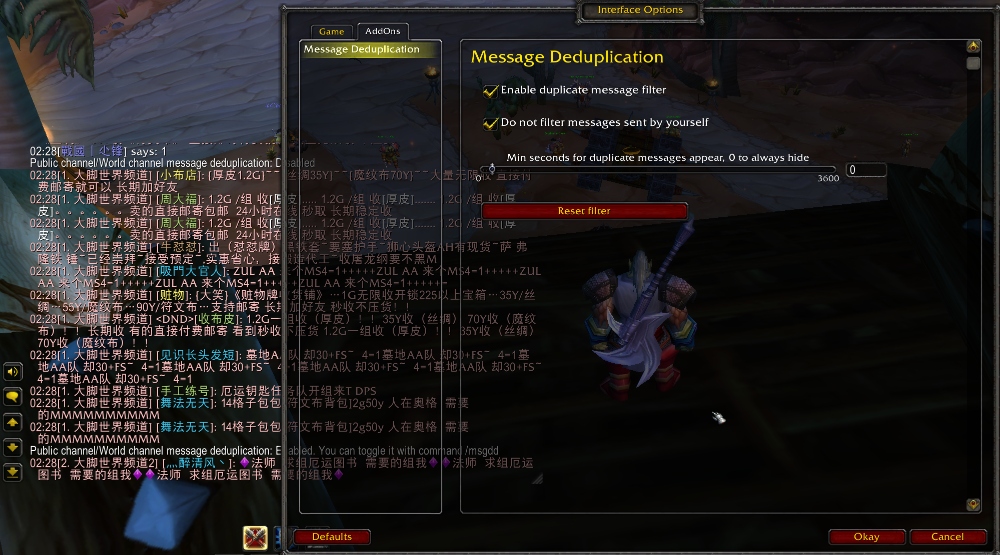

Description
-----------------
Simply filter duplicate messages in public channels and world channels.

Download
-----------------
* [CurseForge](https://www.curseforge.com/wow/addons/messageclassifier/files)

Features
-----------------
* Filter duplicate messages in public/private/world channels. You will only see the same content from the same person once.
* You can set to allow duplicate messages to reappear after a specified number of seconds.

Macro
-----------------
* Enable or disable the filter: `/msgdd`

Screenshots
-----------------

TODO
-----------------
The addon's project name is `Message Classifier`, not the `Message Deduplication`, because it has more targets than a message filter.

I expect to add a UI to the addon to display the messages received and sort by the last arrival time of the duplicate message. In addition, I also consider adding features that are categorized by keyword. You can classify messages by adding keywords as needed.

The target on the UI is similar to LookingForGroup or ClassicLFG, but it can be used not only for Dungeon / RAID, but also for selling, buying, quest or asking a question. And, the purpose of the addon is just to let you find the message you want, not to help you automatically create a team or automatically join a team. The addon does not add any features that automatically send messages.

Although these features have not been implemented, simple message filtering is already available. Currently the addon is titled `Message Deduplication` in Wow to match the functionality it has implemented.
