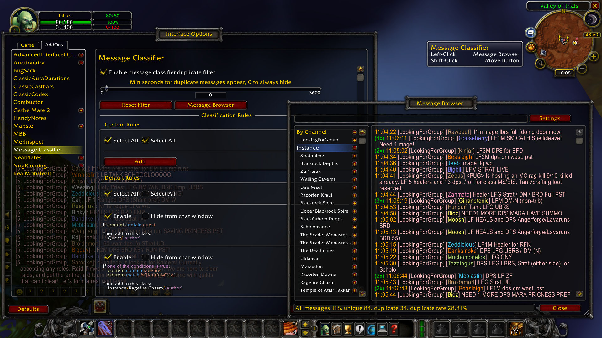

Description
-----------------
Simply filter duplicate messages in public channels and world channels.
At the same time, classify and browse messages with complex and specific rules.

Download 
-----------------
* [CurseForge](https://www.curseforge.com/wow/addons/messageclassifier/files)

Features
-----------------
* Filter duplicate messages in public/private/world channels. You will only see the same content from the same person once.
* You can set to allow duplicate messages to reappear after a specified number of seconds.
* Messages will be classified by custom rules and displayed in the message browser.
* With a simple and clear classification rule editor, you can collect information according to your needs.
* The message browser provides a keyword search function, and the content can be directly selected and copied (ctrl+c).

Macro
-----------------
* Enable or disable the filter: `/msgdd`
* Open the message browser: `/msgcf`

Screenshots
-----------------

